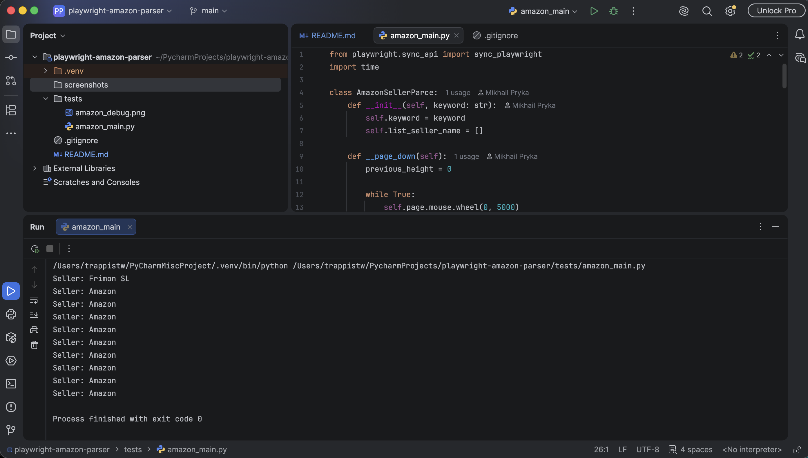

# Amazon Seller Parser (Playwright)

## Project Description

I created this project to practice web automation and data scraping using **Python and Playwright**.

The main goal of the project was to automate work with Amazon pages: perform product searches, open product cards, navigate through pages, and collect seller information.

## Screenshots

### Search results parsing

### Seller extraction

## What I implemented in this project:

* Learned how to control a browser using Playwright:

  * opening web pages
  * navigating through links
  * creating new browser pages/tabs
  * closing pages after finishing the work

* Worked with finding elements on web pages using different approaches:

  * CSS selectors
  * class selectors
  * attribute selectors
  * text-based selectors

* Implemented actions similar to a real user:

  * entering search queries
  * clicking buttons and elements
  * scrolling pages
  * waiting for required elements to load

* Learned how to extract data from HTML:

  * getting element text using `inner_text()`
  * retrieving element attributes using `get_attribute()`
  * analyzing page structure and finding required elements inside HTML

* Worked with dynamic web pages:

  * waiting for elements before extracting data
  * checking if elements exist to avoid errors during parsing

* Processed product cards from search results:

  * iterated through elements using `enumerate()`
  * extracted product links
  * opened product pages to collect additional information

## Technologies Used:

* Python
* Playwright
* CSS Selectors